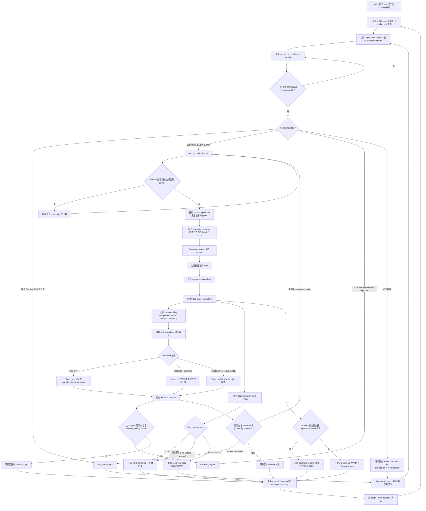

# PMO 主流程图

> 面向人类使用者的主流程图，说明当前 `Sayachan PMO v2` 是如何运行的。

## 用途

当你想从更高层级看 PMO runtime 全貌时，就看这张图。它覆盖：

- intake 与 discussion 分流
- candidate 比较与 human gate 的 sprint 启动
- execution handoff 与 execution return
- 带 validation 视角的 closeout
- documentation-sync review
- 作为独立仓库动作存在的 commit
- idle 状态与下一轮 planning 的回流

## 主流程图

## 阅读提示

- `discussion-workflow.md` 和 `promotion-workflow.md` 负责这张图左侧的 intake 与分流部分。
- `sprint-workflow.md` 负责 sprint selection、closeout 与 commit separation。
- `execution-handoff-protocol.md` 负责 handoff 与 execution return contract。
- `validation-floor-policy.md` 规定 PMO 在 closeout 时如何解读 validation evidence。
- `documentation-sync-policy.md` 与 `documentation-sync-guide.md` 规定 execution 之后的 doc review。
