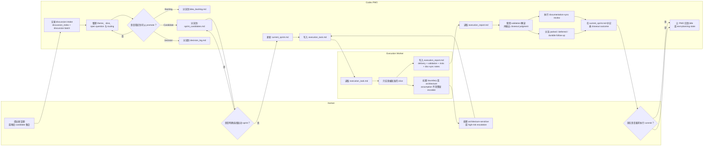

# PMO 角色泳道图

> 面向人类使用者的泳道图，说明当前 `Sayachan PMO v2` 中各角色的职责边界。

## 用途

当你想按角色来理解同一条 PMO 流程，而不是按文档或 policy 来看时，就用这张图。

它主要回答：

- Human 决定什么
- Codex 作为 PMO 拥有什么职责
- Execution Worker 在实现阶段负责什么

## 泳道图

## 阅读提示

- Human 仍然是 sprint selection gate 和 escalation authority。
- Codex 负责 PMO state movement、handoff writing、closeout judgment 与 documentation-sync review。
- Execution Worker 不负责 sprint selection 或 PMO closeout，但负责有边界的 implementation 和结构化 execution return。
