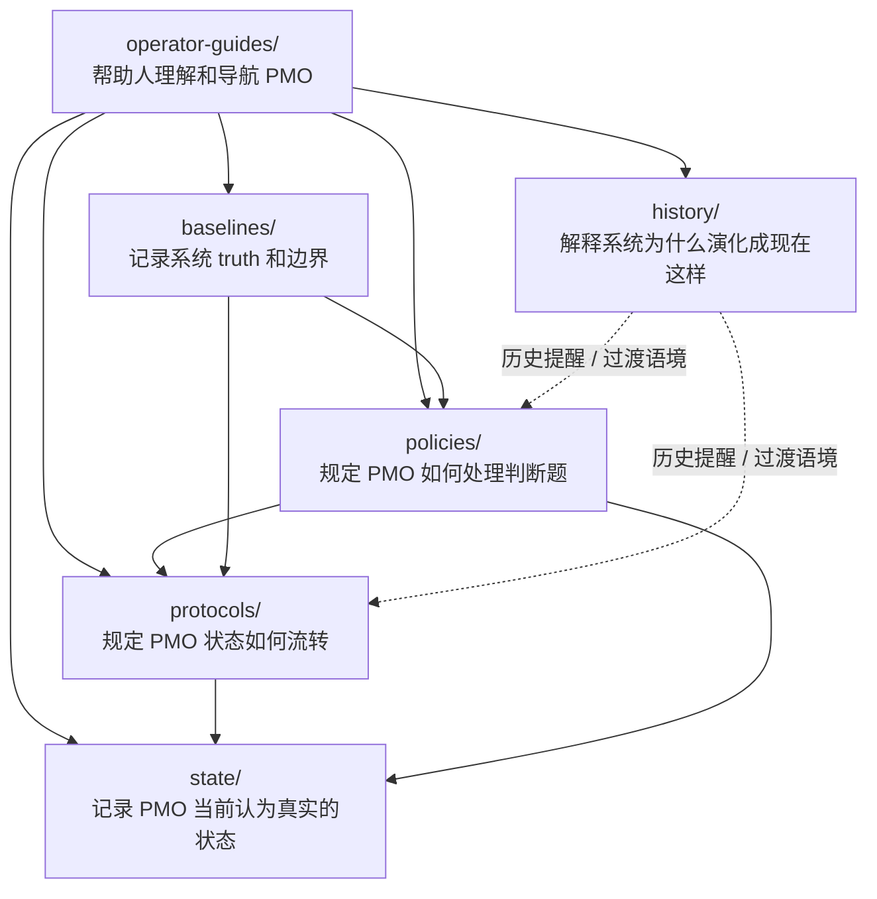

# PMO 系统地图

> 面向人类使用者的系统地图，说明当前 PMO 各层是如何协同工作的。

## 用途

当你想把 PMO 当成一个整体系统来理解，而不是一次只看一个 workflow 时，就用这份图。

它回答这些问题：

- 哪一层承载当前 runtime state
- 哪一层定义流程 contract
- 哪一层承载横向判断规则
- 哪一层承载系统 truth
- 哪一层主要是给人类使用者阅读的

## 分层关系图

## 阅读模型

| 如果你想知道…… | 先看这里 | 再看 |
|---|---|---|
| 当前系统正在做什么 | `state/` | `protocols/` |
| 一个话题应该怎么流转 | `protocols/` | `state/` |
| 某个判断为什么这样做 | `policies/` | 相关 `protocols/` |
| 系统 truth / boundary 是什么 | `baselines/` | 相关 `policies/` |
| 为什么现在会长成这套 PMO | `history/` | `operator-guides/` |
| 我作为人应该从哪里看起 | `operator-guides/` | 相关 canonical docs |

## 心智模型

可以把这套 PMO 想成五个 canonical 层，加一个给人看的解释层：

- `state/`：运行态答复“现在是什么状态”
- `protocols/`：流程 contract 答复“状态怎么流转”
- `policies/`：横向规则答复“遇到判断题时怎么判断”
- `baselines/`：系统 truth 答复“哪些事实和边界是真的”
- `history/`：历史说明答复“为什么会变成现在这样”
- `operator-guides/`：给人看的地图，答复“我应该怎么理解和使用这套系统”
