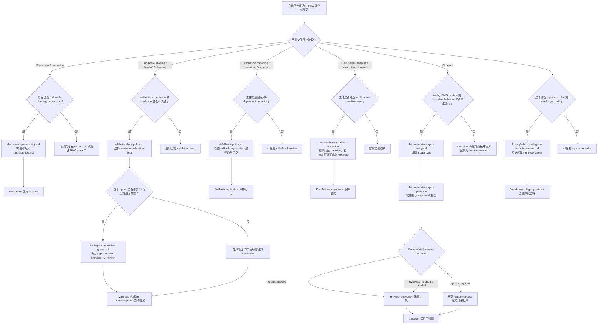

# PMO Policy 触发图

> 面向人类使用者的触发图，说明 PMO 主要 policy 检查在什么条件下被触发。

## 用途

当你想知道下面这些问题时，就看这张图：

- 在某个 PMO 时刻应该检查哪条 policy
- 什么条件会触发这条 policy
- 这条 policy 会导向什么样的 PMO 动作或 review 结果

## Policy 触发图

## 触发说明

- `decision-capture-policy.md` 适用于主产出是 durable planning rule、deferral、approval 或 rejection 的情况。
- `validation-floor-policy.md` 适用于 PMO 必须判断证据是否足以安全 close 一个 sprint 的情况。
- `testing-and-ui-review-guide.md` 会在 sprint 改动 UI 行为或展示质量时，细化 validation 选择。
- `ai-fallback-policy.md` 适用于 AI 行为变化，或 fallback path 可能被悄悄削弱的情况。
- `architecture-sensitive-areas.md` 适用于代码看起来很小，但仍可能改变 system truth 或 boundary responsibility 的情况。
- `documentation-sync-policy.md` 与 `documentation-sync-guide.md` 适用于 closeout 阶段 truth、PMO runtime 或 execution behavior 可能发生变化的情况。
- `history/reference/legacy-transition-notes.md` 是 reminder surface，不是常规阻塞流程。
