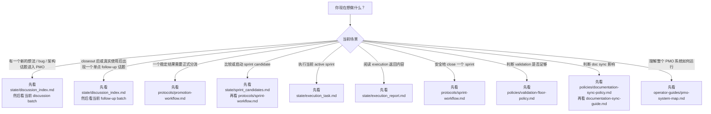

# 从哪里开始看

> 面向人类使用者的导航指南，帮助你判断当前应该先读哪份 PMO 文档。

## 用途

当你已经知道自己现在处于什么场景，但不想靠猜去决定该先读哪份 PMO 文档时，就使用这份指南。

## 快速导航

## 场景对照表

| 场景 | 第一份该看的文件 | 为什么 |
|---|---|---|
| 新话题刚进入 PMO | `state/discussion_index.md` | 先确认当前 discussion 运行面 |
| closeout 后或真实使用后冒出单点 follow-up 话题 | `state/discussion_index.md` | 先判断是否已有 follow-up batch，没有的话新开一个 |
| 需要看 discussion 细节 | `state/discussions/*.md` | 细节只在 batch 里，不在 index 里 |
| 要决定去 backlog / candidate / decision | `protocols/promotion-workflow.md` | 这是正式分流 contract |
| 要看当前候选冲刺 | `state/sprint_candidates.md` | 候选列表就是 runtime state |
| 要启动冲刺 | `protocols/sprint-workflow.md` | human gate 和 activation 规则都在这里 |
| 要执行当前冲刺 | `state/execution_task.md` | 它就是 execution contract |
| 要读执行返回 | `state/execution_report.md` | 它就是 execution return surface |
| 要做 closeout | `protocols/sprint-workflow.md` | closeout 逻辑和分类都在这里 |
| 要判断验证够不够 | `policies/validation-floor-policy.md` | 这是 validation 判断底线 |
| 要判断 UI / browser review | `policies/testing-and-ui-review-guide.md` | 这是 validation 的细化指南 |
| 要判断 doc sync | `policies/documentation-sync-policy.md` | 先判断 trigger，再看 guide |
| 要理解整个系统怎么配合 | `operator-guides/pmo-master-flow.md` | 这是人类操作视角总图 |

## 最小入口集合

如果你只想记一套最小入口：

- 讨论入口：`state/discussion_index.md`
- 候选入口：`state/sprint_candidates.md`
- 执行入口：`state/execution_task.md`
- closeout 入口：`protocols/sprint-workflow.md`
- doc sync 入口：`policies/documentation-sync-policy.md`
- 系统总览入口：`operator-guides/pmo-system-map.md`
